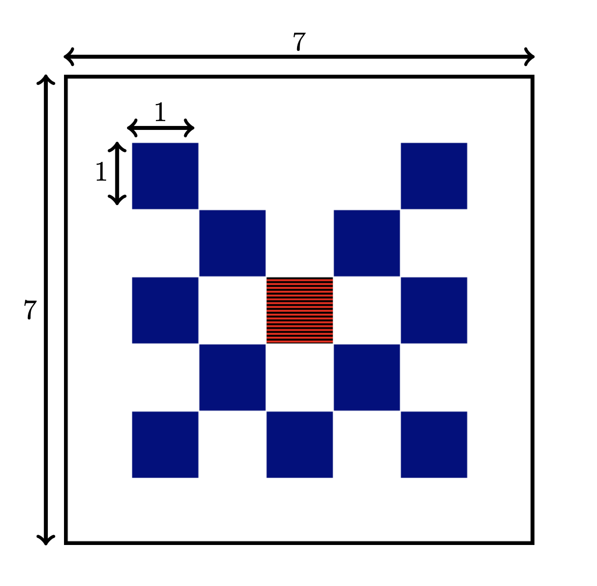

# CharmKiT

CharmKiT is a benchmarking suite for the CharmNet project, providing automated parameter studies and test case management for the [KiT-RT PDE simulator](https://kit-rt.readthedocs.io/en/develop/index.html). It enables reproducible runs of radiative transfer test cases such as the lattice and hohlraum setups, using Python scripts to manage parameter sweeps, configuration, and result collection. CharmKiT supports both high-performance computing (HPC) and local (no-HPC) execution modes, leveraging Singularity containers for reproducibility.


## Installation

Preliminaries:

1. Install [Singularity](https://docs.sylabs.io/guides/latest/user-guide/quick_start.html) on your system.

2. Clone the `CharmKiT` Github repository:
   ```
   git clone git@github.com:ScSteffen/CharmKiT.git
   ```

3. Create a local Python environment and install requirements:
   ```
   python3 -m venv ./venv
   source venv/bin/activate
   pip install -r requirements.txt
   ```

4. Install [KiT-RT](https://github.com/CSMMLab/KiT-RT) as a submodule using the provided installer. (Requires root for container build.)
   ```
   sh install_KiT-RT.sh
   ```
   If updating KiT-RT:
   ```
   sh update_KiT-RT.sh
   ```
   If on a cluster without root, build the container locally and upload it to `CharmKiT/KiT-RT/tools/singularity/`.


## How CharmKiT Works

CharmKiT automates the setup, execution, and result collection for radiative transfer test cases using the KiT-RT solver. The workflow is managed by Python scripts (e.g., `run_hohlraum.py`, `run_lattice.py`) that:

- Define parameter sweeps for each test case (e.g., mesh size, quadrature order, absorption/scattering coefficients).
- Generate the necessary configuration files for KiT-RT.
- Run the KiT-RT solver inside a Singularity container for each parameter combination.
- Collect and save the results (e.g., quantities of interest) as `.npz` files for further analysis.

Scripts support both HPC (SLURM) and local (no-HPC) execution. 


## Running CharmKiT Scripts

CharmKiT provides Python scripts for each test case. These scripts can be run in two modes:

- **HPC mode**: Submits jobs to a SLURM cluster (using `--hpc` flag).
- **No-HPC (local) mode**: Runs all simulations sequentially on your local machine (default).

### Example: Running the Hohlraum Test Case (Local Mode)

1. Activate your Python environment:
   ```
   source venv/bin/activate
   ```
2. Run the script:
   ```
   python run_hohlraum.py --no-hpc
   ```
   This will execute all parameter combinations locally, running KiT-RT inside the Singularity container for each case. Results are saved as `.npz` files in the working directory.

### Example: Running the Lattice Test Case (Local Mode)

1. Activate your Python environment:
   ```
   source venv/bin/activate
   ```
2. Run the script:
   ```
   python run_lattice.py --no-hpc
   ```

### Script Options

Both scripts support various command-line arguments:

- `--no-hpc` : Run locally (default is HPC SLURM execution -  requires SLURM setup).
- `--no-singularity` : Don't use the Singularity container (default: enabled).
- `--load-from-npz` : Loads design and grid parameters from npz file instead of using the presets in the run scripts.


# Test Case Descriptions

## 1. Lattice Test Case

The lattice test case models an isotropic radiative source at the center of a 2D domain, surrounded by a periodic arrangement of blue, red, and white squares. Each color represents a different material with specific absorption, scattering, and source properties:


| Region | Absorption | Scattering | Source |
|--------|------------|------------|--------|
| Blue   | 10         | 0          | 0      |
| Red    | 0          | 1          | 1      |
| White  | 0          | 1          | 0      |

The main design parameters are:
- Number of grid points per square side
- Quadrature order (velocity space)
- Absorption in blue squares
- Scattering in white squares

The script `run_lattice.py` automates parameter sweeps over these variables, generating KiT-RT config files and collecting results. Quantities of interest include outflow and absorption metrics, as well as wall time. The mesh and configuration can be customized via script arguments.

See `benchmarks/lattice/` for config templates and mesh files.

## 2. Hohlraum Test Case

The hohlraum test case simulates radiative transfer in a symmetric 2D cavity (hohlraum) with specified boundary conditions and material properties. The setup is designed to study energy transport and absorption in a geometry relevant to inertial confinement fusion and high-energy density physics.

Key features:
- Central cavity with reflecting and absorbing boundaries
- Parameter sweep over mesh resolution and quadrature order
- Quantities of interest: outflow, absorption, and time-resolved metrics

The script `run_hohlraum.py` manages the parameter study, config generation, and result collection. All runs are executed via the Singularity-encapsulated KiT-RT solver.

See `benchmarks/hohlraum/` for config templates and mesh files.

---


For more details on the scientific background and test case motivation, see the accompanying paper and the documentation in `documentation/`.

---

## Citation

If you use CharmKiT or the provided benchmarks in your research, please cite:

```bibtex
@misc{schotthöfer2025referencesolutionslinearradiation,
      title={Reference solutions for linear radiation transport: the Hohlraum and Lattice benchmarks}, 
      author={Steffen Schotthöfer and Cory Hauck},
      year={2025},
      eprint={2505.17284},
      archivePrefix={arXiv},
      primaryClass={physics.comp-ph},
      url={https://arxiv.org/abs/2505.17284}, 
}
```

